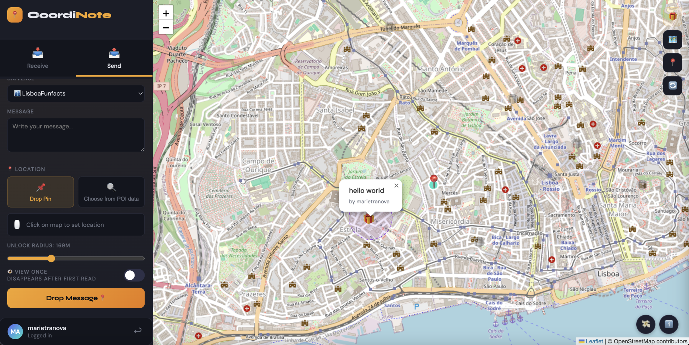

# 📍 CoordiNote - Location-Based Geospatial Messaging App

CoordiNote is an innovative mobile application that bridges the digital and physical worlds. It allows users to drop hidden messages, polls, and memories at specific real-world locations (like metro stations or bus stops). These messages are "geo-locked" and can only be revealed when other users physically walk within a certain radius of the location.

##  Methodology
Our approach integrates real-world spatial data with dynamic user interactions. The core methodology relies on:
1.  **Spatial Proximity Checks:** Utilizing PostGIS to instantly calculate the distance between a user's live GPS coordinates and hidden nodes.
2.  **Automated Data Pipeline:** Implementing an ETL (Extract, Transform, Load) script that autonomously fetches transit location data via the OpenStreetMap Overpass API and structures it into our spatial database.
3.  **Geo-Locked Content Delivery:** A Flask API that acts as the gatekeeper, serving GeoJSON data for map rendering while hiding specific message payloads until the user enters the designated "unlock radius" (e.g., 30 meters).

##  Key Features
* **Location-Based Unlocking:** Messages and polls are strictly tied to real-world coordinates.
* **Dynamic Interactive Map:** Displays nearby nodes and updates lock/unlock status in real-time.
* **Secure Infrastructure:** Passlib (Bcrypt) encryption for user data and secure API endpoints.

##  Prerequisites

Before running the project, ensure you have the following installed:
* **Python 3.10+**
* **PostgreSQL** (with **PostGIS** extension enabled)
* **Git**

##  Installation & Local Setup
### 1. Configure the Database
1. Open pgAdmin or your terminal and create a new database named `coordinote_db`.
2. Enable the spatial extension by running: `CREATE EXTENSION postgis;`
3. Run the SQL schema files to create `locations`, `users`, `universe`, `poll_options`, `poll_votes`, `seen`, `sessions`,` mUnlocked`, `possAnsw`, `userAnsw`, `userUniv`,`spatial_ref_sys`,  and `messages` tables.

### 2. Run the ETL Pipeline
Navigate to the ETL directory to populate the database with real-world map data:
\`\`\`bash
pip install -r requirements.txt
python etl_full_automatic.py
\`\`\`

### 3. Start the API Server
## 🔌 API Endpoints
| Method | Endpoint | Description |
| :--- | :--- | :--- |
| `GET` | `/locations` | Returns all map POIs in GeoJSON format |
| `GET` | `/messages/nearby` | Checks user distance and returns unlocked messages |
| `POST` | `/users/register` | Securely registers a new user with hashed password |

Navigate to the API directory, install the required web and security libraries, and start the Flask server:
\`\`\`bash
pip install flask flask-cors psycopg2-binary passlib bcrypt
python api.py
\`\`\`
*The API will be available at `http://localhost:5000`.*

## 👨‍💻 Authors

##  **Marie Tranová** 
Master's degree in Geospatial Technologies at [NOVA University of Lisbon](https://www.novaims.unl.pt/), [WWU Münster](https://www.uni-muenster.de/en/) and [UJI](https://www.uji.es/)
## **Wilma Kahl**  
Master's degree in Geospatial Technologies at [NOVA University of Lisbon](https://www.novaims.unl.pt/), [WWU Münster](https://www.uni-muenster.de/en/) and [UJI](https://www.uji.es/)
## **Bekir Sıtkı Küçükoğlu**
Master's degree in Geospatial Technologies at [NOVA University of Lisbon](https://www.novaims.unl.pt/), [WWU Münster](https://www.uni-muenster.de/en/) and [UJI](https://www.uji.es/)

